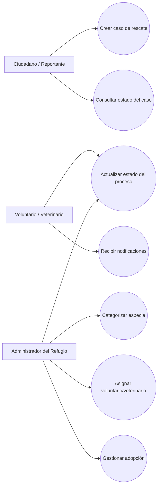
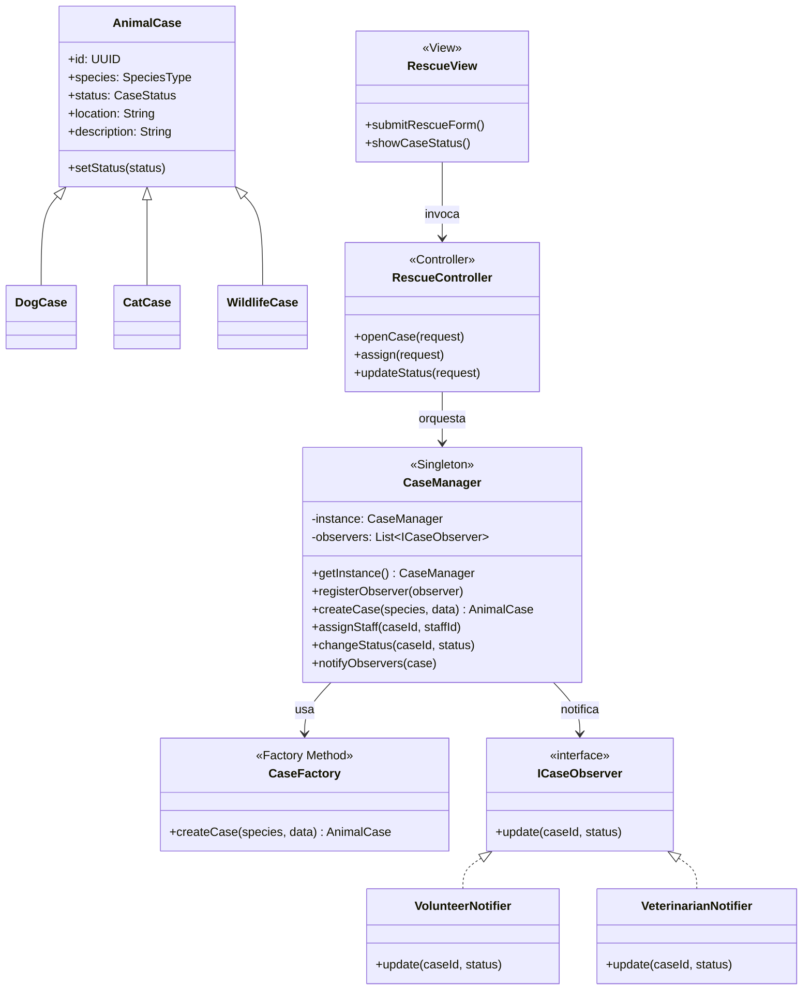
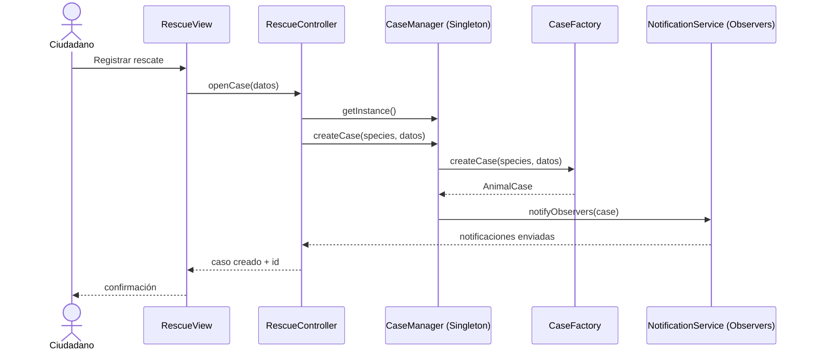

# Sistema de Control de Rescate y Adopción Animal

## 1) Análisis del escenario

### Actores principales
- **Ciudadano / Reportante**: registra casos de rescate y consulta estado.
- **Voluntario / Veterinario**: atiende casos asignados, actualiza tratamiento y seguimiento.
- **Administrador del refugio**: clasifica casos, asigna personal, cierra procesos de adopción.

### Requerimientos funcionales
1. Crear caso de rescate con datos de ubicación, especie y condición inicial.
2. Categorizar especie: **Perro**, **Gato**, **Fauna Silvestre**.
3. Asignar voluntario o veterinario responsable.
4. Gestionar estados del caso: **Rescatado**, **En Tratamiento**, **En Adopción**, **Adoptado**.
5. Notificar automáticamente a responsables cuando ingresa/actualiza un caso.
6. Consultar historial de cambios para trazabilidad.

### Requerimientos no funcionales
- **Escalabilidad**: arquitectura por capas y separación MVC.
- **Mantenibilidad**: aplicación de SOLID y patrones de diseño.
- **Trazabilidad de versiones**: Gitflow con ramas `main`, `develop`, `feature/*`, `release/*`, `hotfix/*`.

---

## 2) Arquitectura lógica propuesta

Patrones aplicados:
- **Singleton**: `CaseManager` centraliza gestión de expedientes y acceso a repositorio de datos.
- **Factory Method**: `CaseFactory` crea instancias específicas de expediente por especie.
- **Observer**: `NotificationService` notifica automáticamente a voluntarios/veterinarios suscritos.
- **MVC** (estructural): separación de `Model` (entidades), `Controller` (casos de uso), `View` (interfaz/API).

### Vista de capas
- **View**: interfaz web/móvil o API de atención.
- **Controller**: orquesta creación, asignación y cambios de estado.
- **Domain/Model**: entidades de negocio y reglas.
- **Infrastructure**: persistencia y mensajería de notificaciones.

---

## 3) Diagrama de casos de uso (UML)



---

## 4) Diagrama de clases UML (SOLID + patrones)



---

## 5) Diagrama de secuencia (Factory + Singleton + Observer)



---

## 6) Justificación técnica de patrones

1. **Singleton (CaseManager)**
   - Evita múltiples motores de gestión inconsistentes.
   - Centraliza reglas de negocio y coordinación de casos.

2. **Factory Method (CaseFactory)**
   - Desacopla la creación de expedientes por tipo de especie.
   - Facilita extensión a nuevas especies sin romper código existente (OCP).

3. **Observer (Notificaciones)**
   - Permite notificaciones reactivas ante eventos de casos.
   - Reduce acoplamiento entre motor de casos y canales/receptores.

4. **MVC**
   - Separa interfaz, orquestación y dominio.
   - Mejora mantenibilidad, pruebas y escalabilidad.

---

## 7) Gitflow aplicado al diseño

Repositorio: **https://github.com/Nickzeer/sistema-rescate-adopcion**

### Estructura de ramas
- `main`: versión estable.
- `develop`: integración continua del diseño.
- `feature/analisis-requerimientos`
- `feature/diagrama-casos-uso`
- `feature/diagrama-clases-patrones`
- `feature/diagrama-secuencia-notificaciones`
- `release/v1.0.0` y `hotfix/*` cuando aplique.

### Flujo sugerido
```bash
git checkout -b develop
git checkout -b feature/analisis-requerimientos develop
# commits del análisis

git checkout develop
git merge --no-ff feature/analisis-requerimientos

git checkout -b feature/diagrama-clases-patrones develop
# commits de UML y patrones

git checkout develop
git merge --no-ff feature/diagrama-clases-patrones

git checkout -b release/v1.0.0 develop
# ajustes finales de entrega

git checkout main
git merge --no-ff release/v1.0.0
git checkout develop
git merge --no-ff release/v1.0.0
```

### Evidencia esperada en GitHub
- Historial de commits por cada rama `feature/*`.
- Pull requests hacia `develop`.
- Merge final de `release/*` hacia `main` y `develop`.
- Capturas del gráfico de ramas (Network/Insights) y lista de commits.

---

## 8) Entregables cubiertos en esta actividad
- ✅ Análisis de actores y requerimientos.
- ✅ Diseño UML (casos de uso, clases y secuencia).
- ✅ Aplicación y justificación de al menos tres patrones (Singleton, Factory Method, Observer, MVC).
- ✅ Definición de uso de Gitflow para trazabilidad profesional.
